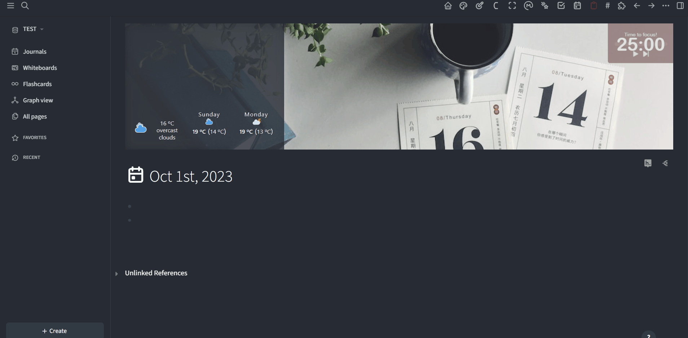
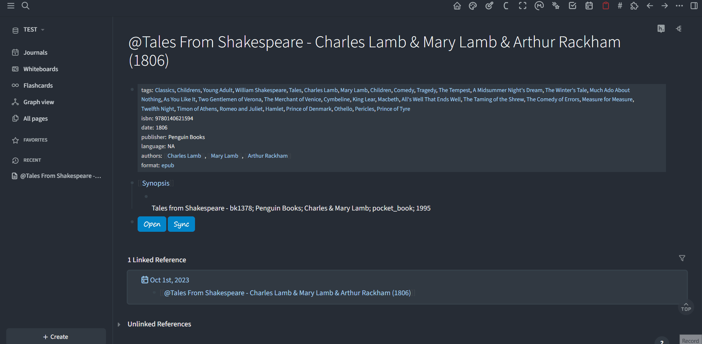
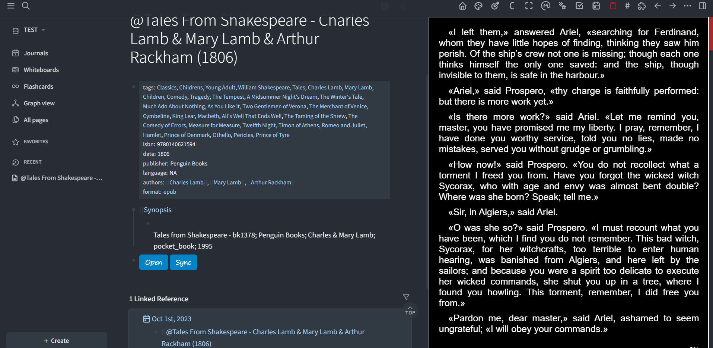

☕ [Support my work](https://www.buymeacoffee.com/duydole00) if you find this helpful!


# Logseq Calibre Annotation

> Now also with features from [`calibreMetadata`](https://github.com/duydl/logseq-calibre-metadata).

Enhance your note-taking experience with Logseq by integrating with [Calibre](https://calibre-ebook.com/), a robust e-book management software, by leveraging Calibre's Content Server API.

- **Calibre Content Server** is a convenient tool for reading e-books in browsers and syncing reading progress and annotations across devices. Now, book metadata and annotations from Calibre can seamlessly sync to your Logseq graph.

**Table of Content**
- [Usage](#usage)
  - [1. Adding Books](#1-adding-books)
  - [2. Opening Viewer](#2-opening-viewer)
  - [3. Syncing Annotations](#3-syncing-annotations)
  - [4. Authentication for User Login](#4-authentication-for-user-login)
  - [5. Additional Tips](#5-additional-tips)
- [Demo](#demo)
  - [Import Books](#import-books)
  - [Viewing and Syncing](#viewing-and-syncing)
  - [Copy Individual Annotations](#copy-individual-annotations)
- [Contribution](#contribution)

## Usage

The `calibreAnnotation` plugin introduces a slash command, `Calibre Annotation: Add a Calibre book`, for importing books from Calibre into Logseq with formats similar to Zotero's.

Additionally, the plugin provides two macro renderers:
- **Calibre Viewer (`calibreViewer`)**: Opens the book at the current progress location or annotation location.
- **Calibre Sync (`calibreSync`)**: Toggles real-time annotation syncing from Calibre to a designated block.

Multiple settings customize the behavior of these features. The **Content Server Link** setting applies to all functions and specifies the URL where the Calibre Content Server is hosted. This URL would typically be set to the loopback address followed by a port number (e.g., `http://localhost:8080`) but can also be a LAN or WAN address.

### 1. Adding Books

Use the slash command, `Calibre Annotation: Add a Calibre book`, to search your library and add book metadata along with template buttons at either the page or block level.

You can configure the import process with the following settings:

- **Calibre Library**: Specify your preferred Calibre library name to search for books.
- **Add as Block**: Choose whether to import the book as a block at the cursor position instead of creating a new page.
- **Page Title Template**: Define the template for new Calibre page titles.
- **Page Properties**: Select metadata properties to include, such as `tags, isbn, date, publisher, language, authors, format`. 
- **Preferred Book Format**: Choose the preferred book format for the Viewer and Sync macros.

### 2. Opening Viewer

The button renderer, `{{renderer calibreViewer, color, link}}`, will open a book viewer in the right sidebar of Logseq. It is automatically added when a book is imported and can open books from a different library than the one in the setting.

You can adjust its appearance and behavior with the following options:

- **Adjust Viewer Width**: Set the viewer width as a percentage. Reopen the viewer for changes to take effect. Your reading position will be remembered.

### 3. Syncing Annotations

The button renderer, `{{renderer calibreSync, syncstate, interval, hostlink_depcreated, lib, id, fmt}}`, toggles the sync process. It imports annotations from Calibre into the corresponding blocks in real-time, preceded by a macro renderer to open the viewer at the annotation location. Clicking again will stop syncing. The block's `lastsync` property tracks the latest sync position.

This renderer is also automatically added when a book is imported. The values of `lib` and `fmt` are controlled in the settings and can be adjusted as needed in macros of individual books.

### 4. Authentication for User Login

When sharing a Calibre library with different users over a LAN or WAN, authentication may be required to manage separate profiles. 

You can configure the authentication settings of the plugin as follows:

- **Username**: Set the username for login.
- **Password**: Set the password for login.
- **Open in Browser**: The sidebar viewer within Logseq does not support scenarios where login is required. Enable this option to open books and annotations in your browser instead of within Logseq.


### 5. Additional Tips


- **Copy Individual Annotations from Viewer:** Annotations in Calibre can be directly copied from the viewer and pasted into Logseq when needed.

    To enable this feature in Calibre:

    1. Go to **Calibre e-Book Viewer** > **Preferences** > **Selection Behavior**.
    2. Enable the option for **Citation Action** (Copy a citation to this text).
    3. In the **Template for citing highlighted text**, add the following:

        ```plaintext
        {{{{renderer calibreViewer, {style_which}, {url}}}}} {text} 
        {notes}
        ```

    For more details on copying annotations from Calibre to Logseq, refer to [this issue discussion](https://github.com/duydl/logseq-calibre-annotation/issues/8#issuecomment-2046574914) and other links referenced there.
  
- **Adjusting Content Server Settings:**

  Navigate to **Calibre** > **Preferences** > **Sharing over the Net** to configure your Content Server settings. You can:

  - Select the option to automatically start the Content Server when Calibre is launched.
  - Adjust the port number for the Content Server.
  - Find the LAN address of the Content Server to access it from devices other than the host.
  - Add users for managing profiles.
  
- **Annotate Webpages:** Save webpages as ePubs and import them into Calibre using tools like [Save as eBook](https://github.com/alexadam/save-as-ebook) Chrome Extension or [Shiori](https://github.com/go-shiori/shiori).

## Demo

<!-- Add GIFs to showcase plugin features -->
### Import Books

<table align="center" style="width: auto; margin: 0 auto;">
  <tr>
    <td align="center"></td>
  </tr>
  <tr>
    <td align="center"><strong>Import as Block</strong></td>
  </tr>
</table>
<table align="center" style="width: auto; margin: 0 auto;">
  <tr>
    <td align="center"></td>
  </tr>
  <tr>
    <td align="center"><strong>Import as Page</strong></td>
  </tr>
</table>

### Viewing and Syncing

<table align="center" style="width: auto; margin: 0 auto;">
  <tr>
    <td align="center"></td>
  </tr>
  <tr>
    <td align="center"><strong>Viewing Book and Syncing Annotations</strong></td>
  </tr>
</table>

### Copy Individual Annotations

<table align="center" style="width: auto; margin: 0 auto;">
  <tr>
    <td align="center"></td>
  </tr>
  <tr>
    <td align="center"><strong>Copy Individual Annotations from Viewer</strong></td>
  </tr>
</table>


## Contribution

To contribute, clone the repository locally, and then build with:

```sh
npm install
npm run build
```

After building, open the Logseq Plugins panel, click on `Load unpacked plugin`, and navigate to your repository location.