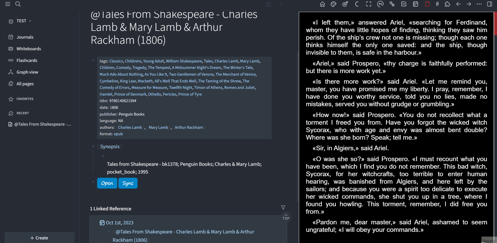

☕ [Get me a coffee](https://www.buymeacoffee.com/duydole00) if you like this work!

# Logseq Calibre Plugins

- calibreMetadata
https://github.com/duydl/logseq-calibre-metadata

- calibreAnnotation
https://github.com/duydl/logseq-calibre-annotation

Enhance your note-taking experience with Logseq by integrating it with [Calibre](https://calibre-ebook.com/), a robust e-book management software. These plugins utilize Calibre's Server API to provide a seamless e-book reading and note-taking experience within Logseq.

## Table of Contents

- [Table of Contents](#table-of-contents)
- [Installation](#installation)
- [Usage](#usage)
  - [calibreMetadata](#calibremetadata)
  - [calibreAnnotation](#calibreannotation)
  - [Notes](#notes)
- [Future Enhancements](#future-enhancements)
- [License](#license)

## Installation

## Usage

To start using these plugins, you'll need to start the Content server of Calibre. 

It is possible to add the content server binary, `calibre-server.exe`, to your startup items for quicker access.

### calibreMetadata

The `calibreMetadata` plugin allows you to import Calibre metadata and generate a dedicated page for taking notes.

You'll first need to specify the name of the library where you store the books you want to import. Other settings can be left at their default values, but feel free to customize them to your preference.

### calibreAnnotation

The `calibreAnnotation` plugin adds two button renderers for `calibreViewer` and `calibreSync`.

- `{{renderer calibreViewer, color, link}}`: This button opens a book viewer on the right-hand side. You could close the viewer, edit the viewer width, or open the book in browser with the control bar.

- `{{renderer calibreSync, syncstate, interval, hostlink, lib, id, fmt}}`: This button initiates the sync process, fetching annotations and applying them to the corresponding blocks in real-time.

You can click on the button again to stop syncing. If needed, you can copy the content to a new block, and it will only sync the latest position as recorded by `lastsync` property of the block.

### Notes

These two plugins can function independently. The `calibreMetadata` plugin only inserts the macros used by the `calibreAnnotation` plugin. 

Without `calibreMetadata`, you can still manually create links to your books. 

Without `calibreAnnotation`, you'll have a block with two non-functional renderer macros after creating page.

- Calibre Content Server is a very convenient tool. Add annotations to your books in a browser or on any other device, and the annotations will seamlessly sync to the page.

- There is now option to adjust the viewer width on opening in the plugin setting: 

## Future Enhancements

- Add location property to highlights to sort by location instead of timestamp
- Add more customized settings
- Adapt to other webtool. Omnivore Highlight, Youtube Timestamp, etc. 
- Add multiple iframe to side viewer. Save state of all opened iframe when new one opened.

## License